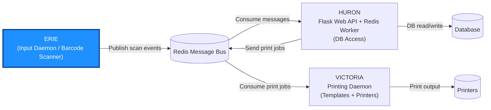

# Erie

Barcode scanner daemon that reads from multiple input sources, processes
barcodes with in-house commands, and publishes results via Redis or stdout.



## Quick Start

```bash
virtualenv venv && source venv/bin/activate
pip install -r requirements.txt && pip install -e .
python -m erie --no-daemon --debug
```

In debug mode, barcodes are read from stdin so you can test without a physical scanner.

```text
usage: erie [-h] [--no-daemon] [--logfile LOGFILE] [--debug] [--pid PID] [-c CONFIG]

optional arguments:
  -h, --help            show this help message and exit
  --no-daemon           Does not start the program as a daemon
  --logfile LOGFILE     Log destination
  --debug               Set the log level to show debug messages
  --pid PID             Pid destination
  -c CONFIG, --config CONFIG
                        Config file location
```

## Configuration

Erie is configured via a YAML (or JSON) file passed with the `-c` flag. Example:

```yaml
erie:
    name: "erie"
    debug: true
    nodaemon: true
    publisher:
        type: "redis"
        host: "localhost"
        port: 6379
        channel: "erie"
    devices:
        - name: "scanner-1"
          type: "serial"
          device_id: "usb-FTDI_FT232R_USB_UART_A9UXOL6H-if00-port0"
        - name: "scanner-2"
          type: "evdev"
          device_id: "usb-USB_Keyboard-event-kbd"
        - name: "dev-input"
          type: "stdin"
```

Example configurations are available in the `configs/` directory.

### Config Fields

| Field | Type | Default | Description |
|---|---|---|---|
| `name` | string | `"erie"` | Application name |
| `debug` | bool | `false` | Enable debug logging |
| `nodaemon` | bool | `false` | Run in foreground instead of as a daemon |
| `logfile` | string | `None` | Log file path (stdout if unset) |
| `pidfile` | string | `None` | PID file path for daemon mode |

### Publisher Config

The default publisher is applied to all devices. Each device can override it with its own `publisher` block.

| Field | Type | Default | Description |
|---|---|---|---|
| `type` | string | `"redis"` | `"redis"` or `"stdout"` |
| `host` | string | `"localhost"` | Redis host |
| `port` | int | `6379` | Redis port |
| `channel` | string | `"erie"` | Redis pub/sub channel |

### Device Config

| Field | Type | Description |
|---|---|---|
| `name` | string | Device name (used in IPC messages) |
| `type` | string | `"serial"`, `"evdev"`, or `"stdin"` |
| `device_id` | string | Device ID resolved under `/dev/serial/by-id/` or `/dev/input/by-id/` |
| `path` | string | Direct device path (alternative to `device_id`) |

## Device Types

| Type | Description |
|---|---|
| `stdin` | Reads from terminal input. Used for development and debugging. |
| `serial` | USB serial barcode scanner via pyserial. Resolves `device_id` to `/dev/serial/by-id/<device_id>`. Baudrate: 9600. |
| `evdev` | Linux input event device (e.g., USB keyboard-mode scanners). Resolves `device_id` to `/dev/input/by-id/<device_id>`. Grabs exclusive access to the device. Translates keyboard keycodes to characters. |

## Commands

Barcodes prefixed with `SPRTCHCMD:` are treated as commands rather than data. The format is:

```txt
SPRTCHCMD:<cmd>:<arg>
```

Commands fall into two categories: **mode** commands that change scanner behavior, and **delay** commands that modify the next scanned barcode.

### Mode Commands

Mode commands switch how subsequent barcodes are handled. Each scanner's mode is independent.

| Command | Description |
|---|---|
| `SPRTCHCMD:MODE:PRINT` | **Print mode** (default). Scanned barcodes are sent to the printer via Redis. |
| `SPRTCHCMD:MODE:INVENTORY` | **Inventory mode**. Scanned barcodes are logged to the database. If the entry exists, the count is incremented. |

### Delay Commands

Delay commands are queued and applied to the next real barcode. They can be stacked.

| Command | Description |
|---|---|
| `SPRTCHCMD:MULTIPLIER:<N>` | Multiply the next action by N. Stackable: `MULTIPLIER:2` then `MULTIPLIER:3` yields factor 6. |
| `SPRTCHCMD:DIGIT:<N>` | Append digit N to the quantity. Chainable to build multi-digit numbers (e.g., `DIGIT:4` then `DIGIT:2` = 42). |
| `SPRTCHCMD:DOT` | Switch to decimal mode. Subsequent `DIGIT` commands append to the decimal part. |
| `SPRTCHCMD:NEGATIVE` | Mark the quantity as negative. In inventory mode, negative quantities remove items. |
| `SPRTCHCMD:CLEAR:0` | Clear all queued delay commands. |

### Quantity Building

The quantity system builds a number from delay commands before applying it to the next barcode:

- `DIGIT:1`, `DIGIT:2` produces `12`
- `DIGIT:4`, `DIGIT:2`, `MULTIPLIER:2` produces `84` (multiplier applies to the integer)
- `DOT`, `DIGIT:2`, `MULTIPLIER:2` produces `0.4` (multiplier applies to the decimal part)
- `NEGATIVE`, `DIGIT:5` produces `-5`

If no `DIGIT` commands are scanned, the default quantity is `1`.

## Architecture

Erie runs each device reader in its own thread, supervised by a main process. When a reader connects, it publishes an `IsAlive` message; on disconnect, a `Disconnect` message. These IPC messages share the same channel as barcode data, allowing downstream consumers (e.g., a printer daemon) to track device presence.

The daemon handles `SIGTERM` and `SIGINT` for graceful shutdown: it signals all threads to stop and disconnects devices. If a reader or publisher becomes unavailable, Erie retries the connection periodically rather than crashing.

## Development

### Linting

```bash
ruff check .
```

### Testing

```bash
pytest test/ -v --timeout=5
```

CI runs on GitHub Actions with Python 3.12.

### Debugging Redis Output

A standalone Redis subscriber script is available for inspecting published messages:

```bash
python scripts/redis_subscriber.py --host localhost --port 6379 --channel erie
```

## License

GPL-3.0, see [LICENSE](LICENSE) for details.
